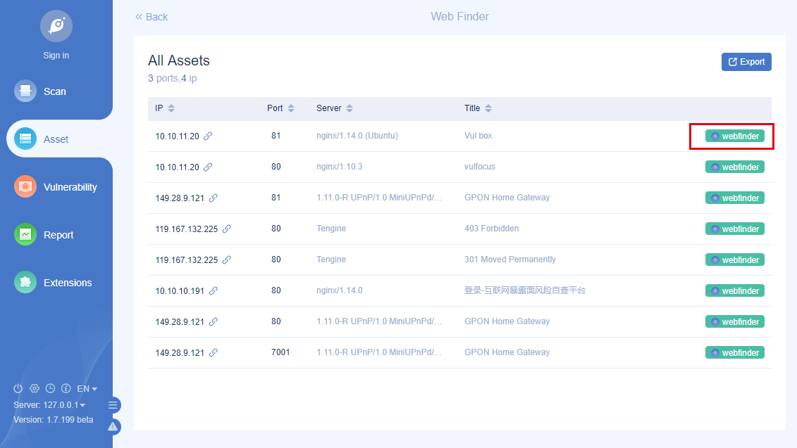
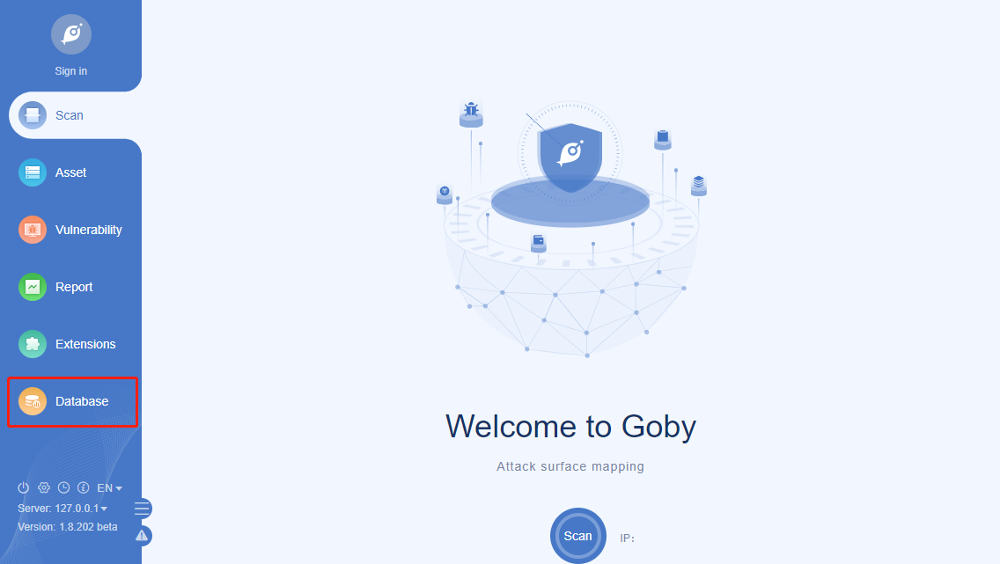
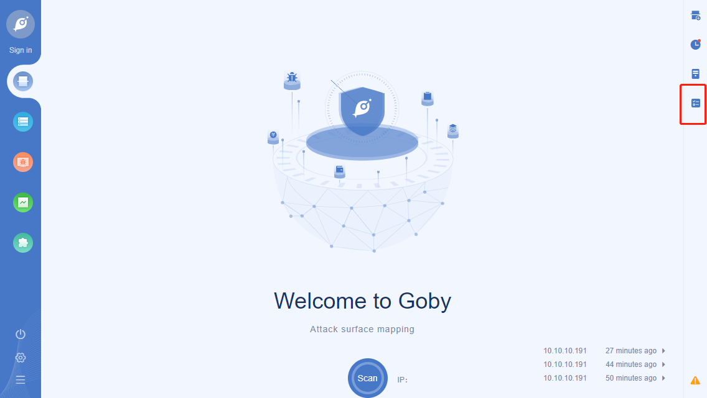
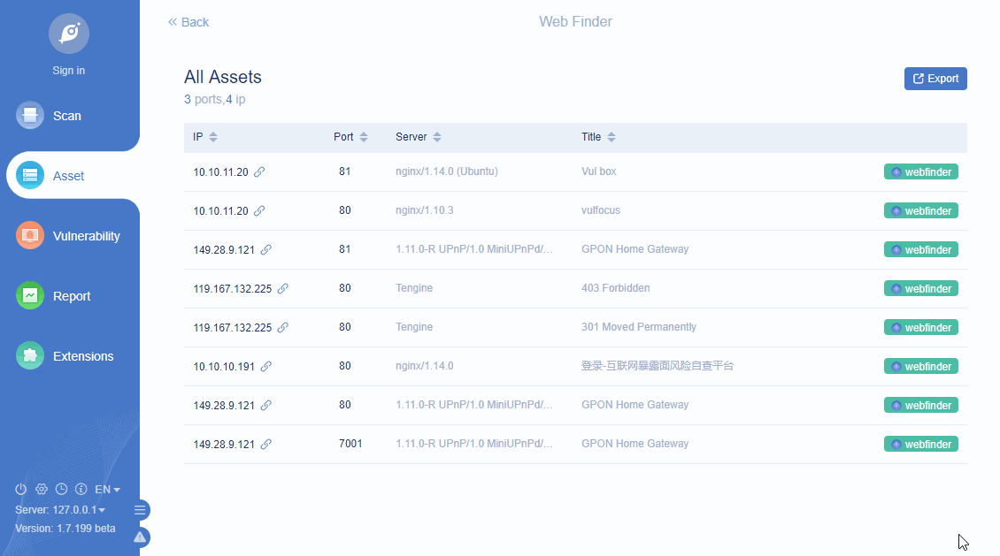

# Overview

Goby has built-in expansion capabilities. Under the extension API blessing, the goby-supported parts can be customized or enhanced.

This document includes following items:

 - How to build, run, debug, test and release extensions.
 - How to use goby’s extensions and API better.
 - Guidelines and code example which help you get started quickly.

## What can extensions do?

1. Expend the workbench by adding custom components and views to interface.

If you want to have a general overview of all APIs, please refer to the function overview. The extension has included code example and guide.

## How to build an extension?

It’s not easy to make a good extension. Let’s take a look at what each chapter of this tutorial can do:

 - **Get started** We will give you a "Hello World" example to get started.
 - **Extension development** Contains various extension development processes, such as testing, packaging and publishing etc.
 - **Extension functions** We disassembled goby’s API into several parts to help you get the development details for each scene.
 - **Example Includes** code example and guide. Detailing specific API usage.
 - **Appendix Including** the details of goby API, contributors and other extra information.


# Get started

## Your first extension

In this section, you will learn some basic concepts.Please install the [Debug](https://api.gobies.org/api/plugin-download/version_hash/785a27e6263d88bf12a947c6b4c135ae)extension of goby first . After that, you need to download a project from (helloWorld). Unzip it under directory goby/extensions then start goby.

Click "Start scan", you will find a hello button at the top of the pop-up window, click the button, if another pop-up windows with [(helloWorld)](https://gobies.org/helloWorld.zip) appears. Congratulations! You have finished this Step.


### Extension Development

Now let’s change the pop-up information:

 - Make sure you are in the "goby/extensions/helloWorld/src/" directory
 - Edit file "extension.js", replace "helloWorld" in function "goby.showInformationMessage" with "helloGoby"
 - Restart goby, click the hello button.

Now you should seen the changed information:


### Use **JavaScript**

In the document we mainly use JavaScript to develop goby extensions.

## Resolving extension structure

In last section, you have learned create a new basic extension by yourself. But how does it work?

The next two concepts will help you:

 - **Publishing configuration**：goby expands the fields of package.json (extension list) to facilitate the development of extensions.
 - **Goby API**：your extension code depends on various JavaScript API.

In general, your extension is to extend the goby’s function by combining publishing content configuration and goby API. You can find appropriate contributions and goby API for your extensions in the "Overview of extension functions".

Now let’s take a look of the example code in "helloWorld", And how the two concepts we mentioned above are applied.

### Extension directory structure

          ├── .gitignore          // Ignore build output and node_modules 
          ├── README.md           // Help document
          ├── CHANGELOG.md        // Update log file
          ├── src
          │   └── extension.js    // Source code
          ├── package.json        // extension configuration list


Now let’s concentrate on the key parts of the extension——package.json and extensions.js

###### extension list

Every Goby extension must contain package.json, That is the extension configuration list. Package.json includes some of Node.js keywords. Such as scripts, dependencies, also added some goby unique fields, such as publisher, initEvents, contributes etc. All this could be found in reference of extension list. We only introduce some important fields in this section.

 - **name**: The extension’s name.
 - **publisher**: The publisher’s name. Goby will combine "publisher" and "name" as a extension’s ID.
 - **main**: The main entrance of extension.
 - **initEvents** 和 **contributes**: Initialize event and publish configurations.
 - **engines**: Describes the lowest version of goby that this extension depends on.

``` json
    {
            "name": "helloWorld",
            "publisher": "goby",
            "description": "helloWorld by goby",
            "version": "0.1.0",
            "icon": "",
            "engines": "1.6.170",
            "initEvents": "",
            "main": "./src/extension.js",
            "contributes": {
              "views": {
                "scanDia": [
                  {
                    "command": "hello",
                    "title": "hello"
                  }
                ]
              }
            },
            "scripts": {},
            "devDependencies": {},
            "dependencies": {}
          }
```


###### Extension’s entry file

Entry file need to export function activate, When the extension is installed successfully, this function will be executed. 
      

``` scilab
    function activate (content) {
            goby.registerCommand('hello', function (content) {
              goby.showInformationMessage("helloWorld");
            });
          }
          
          exports.activate = activate;
```

## Summary

In this section, you learned how to create, run and debug extensions, and also learned the basic concepts of Goby extension development. But this is only a beginner's guide. how to develop extensions will be explained in further detail in later sections.

# Extension development

## Testing extensions

The development version of Goby provides running and debugging capabilities for extension development. Just put your extension into the **goby/extensions** directory, and start Goby.

You can click the **view** button, choose **toggle developer tools** to open the console.     


## Publishing
Functions:
 - User registration
 - Packing
 - Publishing
 - Deleting

### User registration
Before publishing, you should [register](https://gobies.org/user/register) first.


### Packing
We only accept ".zip" format packages currently, you can convert it and upload by yourself or use automatic packaging (Please refer to the next section, we will tell you how to pack your extensions).

**Warning: the entire extension folder must be packaged when packaging, that means after performing automatic decompression, make sure that the directory structure of the entire extension is complete.**


### Publishing
After login, you can publish your extensions from personal center-Extensions management, when zip archive uploaded, we will have specialized personnel to review, after passing the review, the extension will appear in the market list.


### Deleting
You can delete extension in the personal center.


### Packaging extensions
As mentioned before, when the goby extension is submitted, only zip format upload is supported. As for JavaScript, there are many optional packaging tools. This section mainly demonstrates the use of [jszip](https://www.npmjs.com/package/jszip) for packaging.

1. Install the jszip package first

``` ebnf
        npm install jszip
```

2. Then, create build.js in your extension directory

``` javascript
          var JSZip = require('jszip');
          var fs = require('fs');
          var path = require("path");
          var zip = new JSZip();

          // packaging files
          zip.file("package.json", fs.readFileSync(__dirname+"/package.json"));
          zip.file("CHANGELOG.md", fs.readFileSync(__dirname + "/CHANGELOG.md"));
          zip.file("README.md", fs.readFileSync(__dirname + "/README.md"));

          // package files in the folder
          var src = zip.folder("src");
          src.file("extension.js", fs.readFileSync(__dirname + "/src/extension.js"));

          // compress
          zip.generateAsync({
            // select nodebuffer as the compression type，it will return the value of zip file in callback functions ，and then use fs to save to local disk.
            type: "nodebuffer"
          }).then(function (content) {
            let zip = '.zip';
            // write into disk
            fs.writeFile(__dirname + zip, content, function (err) {
              if (!err) {
                // if written successfully
                console.log('Compression successfully');
              } else {
                console.log('Compression failed');
              }
            });
          });
```

3. Finally, execute the packaging command in the extension directory. You will see the packaged zip file in **goby/extensions**.
 

``` crmsh
    node ./build.js
```
        
   

Additionally, jszip is just one of the packaging methods, you can choose your favorite instead.

# Extension Functions
## Overview
Goby provides some methods for extensions to extend the capabilities. But sometimes it is not easy to find the appropriate publishing configuration and goby API. This section contains following parts:

 - Available function for extension.
 - Some inspiration

However, we will also tell you some limit, such as: extensions cannot modify the underlying DOM of Goby UI.

### Common Functions
Common functions are the core functions you may use in any extension.

Including:

 - Registration order
 - Configure the entry point for views
 - Use custom views
 - Configure extension settings
 - Notifications
 - Event Notifications

### Extension workbench
The extension workbench is the view entry point that user can customized, it can enhance the function of goby. For example, you can add new button on the pop-up window. By clicking the corresponding button. You can also import specify IP from other location, adding buttons on the banner list interface, or sending HTTP packet to current IP, even create a custom HTML page for easy use.

Inspiration
 - Customize the operation buttons and interactive behaviors at the top of the scan pop-up window
 - Customize the operation buttons and interactive behaviors of the banner list of the IP details page
 - Use "goby.showIframeDia" method to display custom page content

### Limit
The extension does not have permission to access the underlying DOM of the goby UI, and it is forbidden to add custom CSS and HTML fragments to the goby UI.

## Common functions
Common functions are very important to your extensions. Almost all extensions will use these functions more or less. This section will briefly introduce them for you.

### Commands
Commands are the core of extension, for all the entry points of your customized view, the functions bound to it must be commands.

The goby.registerCommond is indispensable for all extensions to register commands.

### View entry point
Users can customize the buttons at the top of the pop-up window, You can also customize the toolbar extension buttons. Currently goby cannot support much, you can see more in contributions.views.

Custom view
In many cases, only configuring the view entry point is not enough for users. For example, you want to display a custom page which is searchable by clicking the button on the pop-up window, and let the user operate (edit, select) by himself. You need to use a custom view to achieve. Currently goby provides the following APIs to display custom pages:

 - Use the goby.showIframeDia method to display the content of a custom page. In goby, your page will be embedded in a pop-up window for display. The title, width and height of the window can be set by parameters.

 - You can also use the goby.showPagemethod to display the content of a custom page. Goby will embed your page on the right side and this page can run in the background.

### Extension settings
Most extensions will be open for users. If you have this requirement, just fill in the relevant configuration items in contributions.configuration.

At the same time, you can get the extension configuration item from goby.getConfiguration, you can also modify it from goby.setConfiguration.

### Notification
Almost all extensions need to prompt users at some point. Goby provides 4 APIs to display information of different importance.

 - goby.showInformationMessage
 - goby.showWarningMessage
 - goby.showErrorMessage
 - goby.showSuccessMessage

### Event Notifications
In many cases, extensions need to participate in the scanning process and trigger some events when the scanning status changes, or obtain real time scan data. At this time, you can bind event notifications by goby.bindEvent.

## Extension workbench
Workbench refers to the entire goby UI, the current configurable parts are as follows:

 - Pop-up scan page - scanDia
 - Scan result page - scanRes
 - Drop-down menu - moreOptions (Deprecated in：v 1.8.237)
 - IP detail page - ipDetail
 - The title bar of the banner list - bannerTop
 - Vulnerability list - vulList
 - Webfinder page - webfinder
 - Left navigation - page-leftNav (New in：v 1.8.225   Deprecated in：v 1.8.237)
 - toolbar - toolbar (New in：v 1.8.230  )

## Pop-up scan page - **scanDia** 
Modify contributes.views.scanDia in the extension list to add custom components to the top of the pop-up scan page. As shown below:


There is also a simple example for learning about the specific use of scanDia, see the next scanDia part below for more details.

## Scan result page - **scanRes**
###### Drop-down menu - moreOptions
Deprecated in：v 1.8.237

By modifying contributions.views.scanRes.moreOptions in the extension list, you can add custom components to the drop-down menu of the scan results, and the same components will also appear in the asset list and vulnerability list pages. As shown below:


There is also a simple example for learning about the specific use of moreOptions, see the next scanRes part below for more details.

## IP detail page - **ipDetail**
The title bar of the banner list - bannerTop
Modifying contributions.views.ipDetail.bannerTop in the extension list to add custom components to the title bar of the banner list of the IP details page. As shown below:


There is also a simple example for learning about the specific use of bannertTop, see the next ipDetail part below for more details.

## Vulnerability list - **vulList**
Modify the contributions.views.vulList in the extension list to add custom components to the pages related to the vulnerability list. As shown below:


There is also a simple example for learning about the specific use of vulList, see the next ipDetail part below for more details.

## Webfinder page - **webfinder**
Modify the contributions.views.webfinder in the extension list to add custom components to the pages related to the webfinder page. As shown below:



There is also a simple example for learning about the specific use of webfinder, see the next webfinder part below for more details.

## Left navigation page - **leftNav**
**New in：v 1.8.225   Deprecated in：v 1.8.237**

You can configure contributes.views.leftNav in the extension list to add custom components to the left navigation bar. The specific location is as follows:



There is also a example for learning about the specific use of Left-nav, see the left navigation page for details.

## toolbar - **toolbar**
**New in：v 1.8.230**

Modify contributes.views.toolbar in the extension list to add custom components to the toolbar. The specific location is as follows:



There is also a simple example for learning about the specific use of toolbar, see the next scanDia part below for more details.。

# Extension example
## Overview
In the extension function section, document introduced what extension can do. This section details each function and provides detailed code examples.

In this section you will learn:
 - List of goby APIs used
 - List of contributions (published content configuration) used
 - Gif or image of the sample extension

## Pop-up scan page - scanDia
The configuration of the scan pop-up window allows users to customize the processing and operation of scan. This example is mainly to add a button in the scan pop-up window, click to display a custom page. In this page, you can perform FOFA query, get the scanned object, and import IP and port from object.

### Download link
[FOFA](https://gobies.org/FOFA.zip)

### **Goby API** used
 - goby.registerCommand
 - goby.showIframeDia
 - goby.closeIframeDia
 - goby.getConfiguration
 - goby.showConfigurationDia
 - goby.addScanIps
 - goby.addScanPorts
 - goby.showInformationMessage
 - goby.showErrorMessage
 - goby.showSuccessMessage

### Example
First, you need to register the command to be triggered by the custom component.

``` 
          function activate(content) {
            goby.registerCommand('fofa', function () {
              // get extension configuration
              let config = goby.getConfiguration();
              let email = config.email.default;
              let key = config.key.default;
              if (email && key) {
                let path = __dirname + "/fofa.html"
                // display custom page
                goby.showIframeDia(path, "fofa search", "666", "500");
              } else {
                // display extension pop-up configuration
                goby.showConfigurationDia();
              }
            });
          }
          
          exports.activate = activate;
``` 

Second, you need to configure the corresponding view entry point in package.json, function name is contributions.views.scanDia, and fill in the required fields(title, command, icon).  

``` json
    {
		"contributes": {
			"views": {
			"scanDia": [
				{
				"command": "fofa",
				"title": "FOFA",
				"icon": "src/assets/img/fofa.png"
				}
			]
			}  
		}
	}
```
        
Third, because we have used FOFA for collecting, we need to add FOFA account and key to configuration files, just modify contributes.configuration in package.json.      
   

``` json
    {
		"contributes": {
			"configuration": {
				"email": {
					"type": "string",
					"default": "",
					"description": "fofa email"
				},
				"key": {
					"type": "string",
					"default": "",
					"description": "fofa key"
				}
			}
		}
	}
```
        
Fourth, after using the custom component, to display the specific interface, you can use goby.showIframeDia to transfer the html page.

Attention! When using the goby API object in a custom HTML page, it must be obtained through the "parent.goby" function.    


If you want know more, you can [download the code](https://gobies.org/FOFA.zip) to view the details.

The final effect is shown below:


## Scan result page - scanRes.moreOptions
Deprecated in：v 1.8.237

This page allows users to customize the processing and operation of the scanned results. Let's look at a simple example below. This example is used to add a button in the drop-down menu on the scan result page, the button can export selected items to csv file.

### Download link
[ExportCsv](https://gobies.org/ExportCsv.zip)

### **Goby API** used
 - goby.registerCommand
 - goby.showIframeDia
 - goby.closeIframeDia
 - goby.getTaskId
 - goby.getAsset
 - goby.showInformationMessage
 - goby.showErrorMessage
 - goby.showSuccessMessage

### Example
First, you need to register the command to be triggered by the custom component.

``` lua
     function activate(content) {	
            goby.registerCommand('ExportCsv', function () {
              let path = __dirname + "/index.html"
              goby.showIframeDia(path, "export", "334", "210");
            });
          }
          
          exports.activate = activate;
```
        
Second, you need to configure the corresponding view entry point in package.json, function name is contributes.views.scanRes.moreOptions, and fill in the required fields(title, command, icon).    

``` json
    {
            "views": {
              "scanRes": {
                "moreOptions": [
                  {
                    "command": "ExportCsv",
                    "title": "ExportCsv",
                    "icon": "src/assets/img/import.png"
                  }
                ]
              }
            }
          }
```
        
Third, after using the custom component, to display the specific interface, you can use goby.showIframeDia to transfer the html page.

If you want know more, you can [download the code](https://gobies.org/ExportCsv.zip) to view the details.

The final effect is shown below:


## IP detail page - ipDetail.bannerTop
This page allows users to customize the processing and operation of the IP details page. Let's look at a simple example below. This example is mainly to add a button in the banner list of the IP details page, click it to send HTTP packets.

### Download link
[Http](https://gobies.org/Http.zip)

### **Goby API** used
 - goby.registerCommand
 - goby.showIframeDia

### Example
First, you need to register the command to be triggered by the custom component.    

``` lua
     function activate(content) {
            goby.registerCommand('http', function (content) {
              let path = __dirname + "/http.html?hostinfo=" + content.hostinfo;
              goby.showIframeDia(path, "http send packet", "441", "188");
            });
          }
          
          exports.activate = activate;
```
        
Second, you need to configure the corresponding view entry point in package.json, function name is contributes.views.ipDetail.bannerTop, and fill in the required fields(title, command, icon).

``` xquery
       "contributes": {
            "views": {
             "ipDetail": {
                "bannerTop": [
                  {
                    "command": "http",
                    "title": "Http send packet",
                    "icon": "src/assets/img/http.png"
                  }
                ]
             }
            }
           }
```
        
Third, after using the custom component, to display the specific interface, you can use goby.showIframeDia to transfer the html page.

If you want know more, you can download the code to view the details.

The final effect is shown below:


## Vulnerability list - vulList
This page allows users to customize the processing and operation of the vulnerability. Let’s look at a simple example. This example is mainly based on whether the current vulnerability name is in the custom list, display the MSF utilization button dynamically. Click the button to call the local Metasploit framework to detect the vulnerability.

### Download link
[MSF Sploit](https://gobies.org/MSFSploit.zip)

Goby API used
 - goby.registerCommand
 - goby.getConfiguration
 - goby.setConfiguration
 - goby.showInformationMessage
 - goby.showErrorMessage

### Example
First, you need to register the command to be triggered by the custom component. Different from the previous examples is that the callback command controls the component’s visibility. It is bound to the visible field of views and determines whether to display the component according to the returned Boolean value.

```       let cp = require('child_process');
          const os = require('os');
          const fs = require('fs');

          function activate (content) {
              // msf correspondence
              let identical = {
                  "Eternalblue/DOUBLEPULSAR MS17-010 SMB RCE": "exploit/windows/smb/ms17_010_eternalblue"
              };

              // Click to trigger the command
              goby.registerCommand('msf', function (content) {
                  let config = goby.getConfiguration();
                  console.log(config)
                  let ip = content.hostinfo.split(':')[0];
                  let arr = ['C:/metasploit-framework/bin/msfconsole.bat', 'D:/metasploit-framework/bin/msfconsole.bat', 'C:/metasploit-framework/msfconsole'];

                  let urlDefault = '';
                  if (config.url.default) {
                      urlDefault = config.url.default
                  } else {
                      let isExistence = arr.filter(v => {
                          return fs.existsSync(v)
                      })
                      urlDefault = isExistence[0];
                      goby.setConfiguration("url", urlDefault)
                  }

                  if (!urlDefault) return goby.showInformationMessage('Please set the plug-in installation path');

                  let url = `${urlDefault} -x "use ${identical[content.name]}; set rhosts ${ip} ; run"`
                  if (os.type() == 'Windows_NT') {
                      //windows
                      cp.exec(`start ${url}`)
                  } else if (os.type() == 'Darwin') {
                      //mac
                      cp.exec(`osascript -e 'tell application "Terminal" to do script "${url}"'`)
                  } else if (os.type() == 'Linux') {
                      //Linux
                      cp.exec(`bash -c "${url}"`)
                  }
              });

              // callback command controls the visibility
              goby.registerCommand('msf_visi', function (content) {
                if (identical[content.name]) return true;
                return false;
              });
          }

          exports.activate = activate;
```
        
Second, you need to configure the corresponding view entry point in package.json, function name is contributes.views.vulList, and fill in the required fields(title, command and callback command).         

``` xquery
     "contributes": {
            "views": {
              "vulList": [
                {
                  "command": "msf",
                  "title": "MSF",
                  "visible": "msf_visi"
                }
              ]
            }
          }
```
        
Third, because it will call the local Metasploit, you need to modify the configuration which contains Metasploit’s installation path. Just add path to contributes.configuration in package.json.

``` xquery
       "contributes": {
            "configuration": {
              "url": {
                "type": "string",
                "default": "",
                "description": "Please enter the extension address"
              }
            }
          }
```
        
If you want know more, you can [download the code](https://gobies.org/MSFSploit.zip) to view the details.

The final effect is shown below:     


## Webfinder page - webfinder
The webfinder page allows users to customize the processing and operation of the scanned web list. Let’s look at a simple example. In this example, just click the button on the webfinder page to display hostinfo.

### Download link
[Webfinder](https://gobies.org/Webfinder.zip)

### **Goby API** used
 - goby.registerCommand
 - goby.showIframeDia
 - goby.closeIframeDia

### Example
First, you need to register the command to be triggered by the custom component.  

``` javascript
    function activate(content) {
      goby.registerCommand('webfinder', function (content) {
        let path = __dirname + "/index.html?hostinfo=" + content.hostinfo;
        goby.showIframeDia(path, "webfinder", "441", "188");
      });
    }

    exports.activate = activate;
```
        
Second, you need to configure the corresponding view entry point in package.json, function name is contributes.views.webfinder, and fill in the required fields(title, command). 

``` xquery
    "contributes": {
      "views": {
      "webfinder": [
          {
            "command": "webfinder",
            "title": "webfinder",
            "icon": "src/assets/img/logo.png"
          }
        ]
      }
    }
```
        
If you want know more, you can [download the code](https://gobies.org/Webfinder.zip) to view the details.

The final effect is shown below:



## Left navigation page - leftNav
**New in：v 1.8.225   Deprecated in：v 1.8.237**

The navigation page on the left allows users to execute the extensions globally to perform custom processing and operations during the process. We will show you an example. This example is mainly on the left navigation page, click the button to call the showPage API and the bindEvent API on the custom page,so that you can get data and filter them.

### Download link
[Database Asset](https://gobies.org/Database%20Asset.zip)

### **Goby API** used
 - goby.registerCommand
 - goby.showPage
 - goby.bindEvent
 - goby.changeBadge

### Example
First, you need to register the command to be triggered by the custom component.

``` javascript
    function activate(content) {
      goby.registerCommand('webfinder', function (content) {
        goby.showPage('./assets/index.html',true);
      });
    }

    exports.activate = activate;
```

Secondly, you need to configure the corresponding view entry point in package.json which is also called contributions.views.leftNav, then edit the title and corresponding command you want.

``` xquery
    "contributes": {
      "views": {
      "leftNav": [
          {
            "command": "left-nav",
            "title": "Database",
            "icon": "src/assets/img/logo.png"
          }
        ]
      }
    }
```

Thirdly, after clicking the custom component, you can use goby.showPage to display the user-defined interface, This function can also use to pass the html page path. Both absolute path and relative path are supported. The second parameter is whether to run this page in the background.

``` javascript
    goby.showPage('./assets/index.html',true);
```

Attention: when using the goby API object in the custom page provided by goby.showPage, there is no need to obtain it through parent.goby(This function is not recommended here).

Fourth, because goby.bindEvent is called in the showPage function, this command needs to be configured in initEvents parameters in package.json.

``` javascript
          {
            "name": "Database Asset",
            "publisher": "Goby Team",
            "description": "This extension can perform statistics on the ip information of database assets in the scanning process in real time, and can view the details. (Currently only supports `Mysql`, `Redis`, `MongoDB`, `Elasticsearch`) 
",
            "initEvents": ["left-nav"]
          }
```

Fifth, when the scan started, filter the returned data, display the corresponding data, and call goby.changeBadge to display the summary of current task.

Currently, the first parameter only supports leftNav, the second parameter is the command corresponding to the marked position, and the third parameter is the content displayed by Badge.

``` javascript
          //num is the amount of eligible data
          
          goby.changeBadge('leftNav','left-nav',num);
```

If you want know more, you can [download the code](https://gobies.org/Database%20Asset.zip) to view the details.

The final effect is shown below:


## toolbar - toolbar
**New in：v 1.8.230**

The configuration of the toolbar allows users to call the extensions globally. Let's look at a simple example below. This example is mainly to add a button in the toolbar, click the operation to generate a task queue.

### Download link
[Task Queue](https://gobies.org/Task%20Queue.zip)

### **Goby API** used
- goby.registerCommand
- goby.showIframeDia
- goby.getScanState
- goby.bindEvent
- goby.startScan
- goby.getPortList
- goby.getVulnerabilityList
- goby.getOrderList

### Example
First, you need to register the command to be triggered by the custom component.

``` javascript

    function activate(content) {
      goby.registerCommand('addTask', function (content) {
        let path = require('path');
        let url = path.join(__dirname,'./assets/taskQueue.html');
        goby.showIframeDia(url,'Task Queue',666,600);
      });
    }
    
    exports.activate = activate;
```

Second, you need to configure the corresponding view entry point in package.json, function name is contributions.views.toolbar, and fill in the required fields(title, command, icon).

``` json
    "contributes": {
      "views": {
        "toolbar": [
          {
            "command": "addTask",
            "title": "Task Queue ",
            "icon": "src/assets/img/logo2.png",
            "tips":"Task Queue"
          }
        ]
      }
    }
```

Fourth, after using the custom component, to display the specific interface, you can use goby.showIframeDia to transfer the html page.

If you want know more, you can [download the code](https://gobies.org/Task%20Queue.zip) to view the details.

The final effect is shown below:


# Appendix
## Goby API
### About commands
The goby API is a series of JavaScript APIs provided for goby extension developers. All goby APIs are as follow:

#### registerCommand
Registration command, the command name of different extensions can be the same.

[Watch the video to learn more](https://www.bilibili.com/video/BV1u54y147PF?p=6)

**Request**

Parameter|Type|Default|Required|Description
--|:--|:--|:--|:--
name|String| | Yes|Name of command
callback(content)|Function| | Yes|The callback function of the command. The callback function will return the value of content, and varies according to the views (view entry point) bound by the command

**callback(content)**

views（view Entry Point）|Existence|Type|Example|Description
--|:--|:--|:--|:--
scanDia|False	|	|	|
scanRes.moreOptions|False	|	|	|Deprecated in：v 1.8.237
toolbar|	|	|	|
ipDetail.bannerTop|True|Object	|{ hostinfo: "80.241.214.220:25", port: "25", protocol: "smtp" }|hostinfo: host information；port: port；protocol: protocol
vulList|True|Object|{ "hostinfo":"127.0.0.1", "name":"Eternalblue/DOUBLEPULSAR MS17-010 SMB RCE", "filename":"smb_ms17_010.json", "level":"3", "vulurl":"", "keymemo":"", "hasexp":false }|hostinfo: host information；name: Vulnerability name；filename: Vulnerability file name；level: Threat level；vulurl: vulnerability link location

### About UI
#### showIframeDia
Show the pop-up window of the embedded iframe.

If you need to use goby API in a custom html page, you must call parent.goby to get the instance object.

**Request**

Parameter|Type|Default value|Required|Description
--|:--|:--|:--|:--
url|String	|	|Yes|Source address of iframe
title|String	|	|No|Title of iframe
width|Number|666|No|Width of iframe
height|Number|auto|No|Height of iframe，the maximum height is 500, if exceeds show scroll bar

#### closeIframeDia
Close the pop-up window.

#### showPage
**New in 1.8.225+**

The custom page provided by showPage does not need to use parent.goby to obtain the instance object, goby can be used directly.

[Watch the video to learn more](https://www.bilibili.com/video/BV1Ha411w7RF?from=search&seid=11763570465244390878)

**Request**

Parameter|Type|Default Value|Required|Description
--|:--|:--|:--|:--
url|String  |  |Yes  |The url of the custom page supports absolute and relative paths. If you need an absolute path, you can use __dirname and __filename to get the current directory and file path for splicing
background|Boolean|false  |No |whether the opened page is running in the background, if it is true, the page will not be reloaded every time when access the page, otherwise not.

#### openExternal
**New in 1.8.225+**

Open the url link in the browser

[Watch the video to learn more](https://www.bilibili.com/video/BV11z4y1k7zP?from=search&seid=12528056831390729887)


**Request**

Parameter|Type|Default Value|Required|Description
--|:--|:--|:--|:--
url | String  |   | Yes |The url link in browser, the link must contain http, https, localhost or file protocol.

#### changeBadge

**New in 1.8.225+**

Modify the number or status of the button or icon

[Watch the video to learn more](https://www.bilibili.com/video/BV1Ur4y1F7Bp?from=search&seid=12528056831390729887)

**Request**

Parameter|Type|Default Value|Required|Description
--|:--|:--|:--|:--
placement|String| |Yes|marked position，v 1.8.225-v 1.8.230 only supports leftNav，v 1.8.237+ only supports toolbar.
command|String| |Yes|The command corresponding to the mark position, if it is the mark of the extension's entry point, the command will bind to entry point's command.
content|<br> String｜Number <br>|  |No|Mark the displayed content, support Number and String. String can pass html fragments, the default is empty.

#### flashFrame
**New in v 1.8.239+**

Starts or stops flashing the window to attract user's attention

**Request**

Parameter|Type|Default|Required|Description
--|:--|:--|:--|:--
isFlash | Boolean  |   | Yes  |	true：Starts flashing the window ；false： stops flashing the window

#### isFocused

**New in v 1.8.239+**

Whether the Goby window is focused

**Response**

Response|Type|Example|Required|Description
--|:--|:--|:--|:--
isFocused | Boolean   | true | false  |true：Goby window is focused； false：Goby window is not focused

### About configuration
#### getConfiguration
Get the configuration of the current extension.

**Request**

Parameter|Type|Default Value|Required|Description
--|:--|:--|:--|:--
name|String| |No|The obtained extension configuration field name

**Response**

Response|Type|Description
--|:--|:--
value|Object/String|Show the requested configuration of extension, if name is NULL show all

#### setConfiguration
Modify the configuration of current extension.

**Request**

Parameter|Type|Default Value|Required|Description
--|:--|:--|:--|:--
name|String		||Yes|The extension name you want to modify
value|String	|	|Yes|The extension value you want to modify

#### showConfigurationDia
The pop-up windows to show all configurations.

### About notification
#### showInformationMessage
Show information message for users.

**Request**

Parameter|Type|Default value|Required|Description
--|:--|:--|:--|:--
message|String	|	|Yes|Display information content

#### showWarningMessage
Show warning message for users.

**Request**

Parameter|Type|Default value|Required|Description
--|:--|:--|:--|:--
message|String	|	|Yes|Display information content

#### showErrorMessage
Show warning message for users.

**Request**

Parameter|Type|Default value|Required|Description
--|:--|:--|:--|:--
message|String	|	|Yes|Display information content

#### showSuccessMessage
Show success message for users.

**Request**

Parameter|Type|Default value|Required|Description
--|:--|:--|:--|:--
message|String	|	|Yes|Display information content

### About task
#### getTaskId
Get current task ID

**Response**

Response|Type|Description
--|:--|:--
taskId|String|Current task ID

#### getScanState

**New in 1.8.230+**

Get current scan status

**Response**

Response|Type|Example|Description
--|:--|:--|:--
scanState|Object|{state:0,progress:100}|state:current scan status,0:Not started；1:Scanning；2:Scan complete；3:Scanning is stopping；4:Scanning aborted (pause)；5:Exception found progress:current task progress

#### getAsset
Get all asset data of the current task.

**Request**

Parameter|Type|Default value|Required|Description
--|:--|:--|:--|:--
taskId|String	|	|Yes|Task ID
callback(result)|Function	|	|Yes|The callback function of asset data, result is all asset data of the current task

**callback(result)**

Property|Type|Description
--|:--|:--
statusCode|Number|Status code, 200 is OK
messages|String|Status information
data|Object/null|Object of asset data, if there is no data, return unll

**result.data**

Property|Type|Description
--|:--|:--
taskId|String|Task ID
query_total|Object|Total information for assets query
total|Object|Asset data statistics
ips|Object|Assets list

**callback(result) return code example**      

``` json
     {
              "statusCode": 200,
              "messages": "",
              "data": {
                "taskId": "20200509004148",
                "query_total": {
                  "ips": 7,
                  "ports": 11,
                  "protocols": 13,
                  "assets": 8,
                  "vulnerabilities": 0,
                  "dist_ports": 11,
                  "dist_protocols": 12,
                  "dist_assets": 6,
                  "dist_vulnerabilities": 0
                },
                "total": {
                  "assets": 8,
                  "ips": 7,
                  "ports": 11,
                  "vulnerabilities": 0,
                  "allassets": 0,
                  "allips": 0,
                  "allports": 0,
                  "allvulnerabilities": 0,
                  "scan_ips": 0,
                  "scan_ports": 0
                },
                "ips": [{
                  "ip": "192.168.31.213",
                  "mac": "d4:61:9d:63:62:06",
                  "os": "",
                  "hostname": "",
                  "ports": null,
                  "protocols": {},
                  "tags": [{
                    "rule_id": "10000011",
                    "product": "Apple_Device",
                    "company": "Apple",
                    "level": "1",
                    "category": "Server",
                    "parent_category": "Network Device",
                    "soft_hard": "1"
                  }],
                  "vulnerabilities": null,
                  "screenshots": null,
                  "favicons": null,
                  "hostnames": [""]
                }]
              }
            }
```
        
      
#### addScanIps
Add ips to scan array.

**Request**

Parameter|Type|Default value|Required|Description
--|:--|:--|:--|:--
ips|Array	|	|Yes|Ips array you want to add
type|Number	|	|Yes|The way of adding;0 is append, 1 is overwrite

#### addScanPorts
Add ports to scan array.

**Request**

Parameter|Type|Default value|Required|Description
--|:--|:--|:--|:--
ports|Array| |Yes|Ports array you want to add
type|Number	|	|Yes|The way of adding;0 is append, 1 is overwrite

#### getPortList
**New in 1.8.230+**

Get the list of goby's built-in and custom ports

**Response**

Response|Type|Description
--|:--|:--
portList|Promise|his is a Promise object. You can capture the data of success and failure through 'then' and 'catch' respectively, or it can be obtained through 'async' and 'await' in es8.

**Example of returning Promise object data (partial)**

``` js
  {
	statusCode:200,	        //Status code, 200 is OK
	message:"",		//Status information
	data:[
	 {
		type:"Minimal",
		value:"21,22,80,U:137,U:161,443,445,U:1900,3306,3389,U:5353,8080"
	 },
	 {
		type:"Backdoor Check",
		value:"50050"
	 }
	]
      }
```
#### getVulnerabilityList

**New in 1.8.230+**

Get the list of built-in and custom vulnerabilities in goby

**Response**

Response|Type|	Description
--|:--|:--
vulnerabilityList|Promise|This is a Promise object. You can capture the data of success and failure through 'then' and 'catch' respectively, or it can be obtained through 'async' and 'await' in es8.

**Example of returning Promise object data (partial)**

``` js
	{
		statusCode:200,	        //Status code, 200 is OK
		message:"",		//Status information
		data:[
			"General Poc",	//General Poc
			"Brute Force",	//Brute Force
			"Web Application Vulnerability",	//Web Application Vulnerability
			"Application Vulnerability",		//Application Vulnerability
			"All",	//all vulnerability
			"Disabled",	//disable function
			"ACME mini_httpd Arbitrary File Read (CVE-2018-18778)"
		]
	}
```

**In v 1.8.268+，Update the data information of the Promise object**

Return Promise object data example (partial)
``` js
        {
          statusCode:200,   //Status code, 200 is OK
          message:"",	    //Status information
          data:[
            {
              "name":"General Poc",		//General Poc
              "vulnerabilityType":"0"		//Vulnerability scan type
            },
            {
              "name":"Brute Force",		//Brute Force
              "vulnerabilityType":"1"		//Vulnerability scan type
            },
            {
              "name":"Web Application Vulnerability",	//Web Application Vulnerability
              "vulnerabilityType":"4"			//Vulnerability scan type
            },
            {
              "name":"Application Vulnerability",	//Application Vulnerability
              "vulnerabilityType":"5"			//Vulnerability scan type
            },
            {
              "name":"All",             //All vulnerabilities
              "vulnerabilityType":"2" 	//Vulnerability scan type
            },
            {
              "name":"Disabled",        //Disabled
              "vulnerabilityType":"-1" 	//Vulnerability scan type
            },
            {
              "name":"ACME mini_httpd Arbitrary File Read (CVE-2018-18778)",
              "vulnerabilityType":"3"
            }
          ]
        }

```
#### getOrderList

**New in 1.8.230+**

Get a list of scan sequences

**Response**

Response|Type|Description
--|:--|:--
orderList|Promise|This is a Promise object. You can capture the data of success and failure through 'then' and 'catch' respectively, or it can be obtained through 'async' and 'await' in es8.

**Return Promise object data example**

``` js
  {
    statusCode:200,     //Status code, 200 is OK
    message:"",         //Status information
    data:[
      "Assets first",   //assets first
      "Simultaneously"  //scan simultaneously
    ]
  }
```
#### startScan

**New in 1.8.230+**

Start a new task

**Request**

Parameter|Type|Default Value|Required|Description
--|:--|:--|:--|:--
Options|Object| |Yes|Information needed to start a scan task

**Options**

Property|Type|Default Value|Required|Description
--|:--|:--|:--|:--
ip|Array| |Yes|The ip or domain name of the task
port|String| |Yes|Scan task port, use "," to connect to different ports
vulnerability|String|General Poc|No|Vulnerabilities in task
order|String|Assets first|No|Scan sequence of task
taskName|String| |No|The name of the task

**In v 1.8.268+ Options add vulnerabilityType and update vulnerability**

**Options**

Property|Type|Default Value|Required|Description
--|:--|:--|:--|:--
vulnerabilityType|Number|0|Yes|Types of scan vulnerabilities
vulnerability|Object|{}|No|When vulnerabilityType is 3, this parameter is valid, and multiple vulnerabilities in the parameter can be selected, for example:{"Elasticsearch unauthorized":null,"Harbor Default Credentials":null}，the value is currently only null

**Response**

Response|Type|Description
--|:--|:--
data|Promise|This is a Promise object. You can capture the data of success and failure through 'then' and 'catch' respectively, or it can be obtained through 'async' and 'await' in es8.

**Example of returning Promise object data**

``` js
  {
    statusCode:200, //Status code, 200 is OK
    messages:"",    //Status information
    data:{
      taskId: "20201207192026"
    }
  }
```

#### stopScan

**New in 1.8.230+**

Stop current scan

**Response**

Response|Type|Description
--|:--|:--
data|Promise|Returned information when scan stop，This is a Promise object. You can capture the data of success and failure through 'then' and 'catch' respectively, or it can be obtained through 'async' and 'await' in es8.

**Example of returning Promise object data**

``` js
	{
		statusCode:200, //Status code, 200 is OK
		messages:"",    //Status information
		data:{
			taskId:"20201207192026"
		}
	}
```

###  Event notification

#### bindEvent

**New in 1.8.225+**

Binding event notification

[Watch the video to learn more](https://www.bilibili.com/video/BV1Py4y1q7LD?from=search&seid=12528056831390729887)

**Request**

Parameter|Type|Default Value|Required|Description
--|:--|:--|:--|:--
type|String|  |Yes|Type of notification included︰onApp，onPort，onProtocol，onVulnerable，onStartScan，onEndScan，onBackIndex，onPauseScan，onContinueScan，onRescan，onRescanVulnerability
callback(content)|Function| |Yes|The callback function of the binding event, different types and content data are also different

Example of callback(content) Return data

The following types are related to the scanned data, and the content data returned is as follows:

type:onAPP, return App-related data

``` json
    {
        "hostinfo":"127.0.0.1:443",   
        "product":"Bootstrap"         
    }
```

type:onPort, return port-related data

``` json
  {
    "URL":"",
    "addition":"",
    "baseprotocol":"tcp",
    "ip":"127.0.0.1",
    "port":"80",
    "protocol":""
  }
```

type:onPortocol, return protocol-related data

``` json
  {
    "hostinfo":"127.0.0.1:80",
    "protocol":"http"
  }
```

type:onVulnerable, return vulnerable-related data

``` json
  {
    "hostinfo":"http://127.0.0.1",
    "vulnerable":false
  }
```

The following types are related to the scanning status, and the corresponding content data returned are consistent. Examples are as follows

type : onStartScan start scan

type : onEndScan stop scan

type : onPauseScan pause scan

type : onContinueScan continue scan

type : onBackIndex back to index page

type : onRescan restart scan

type : onRescanVulnerability restart vulnerability scan

``` 
  {
    "taskId":"20201113102303",  //task id
    "taskName":""               //task name
  }
```

type：onError,When an error occurs in Goby, return the error-related data

**New in 1.8.239+**

``` 
  {
    "taskId":"20201113102303",  //task id
    "taskName":""               //task name
    "statusCode":"501",         //Status code
    "message":"service error"   //error message
  }
```
type : onChangeLang, When the Goby language changes, return to the current language

**New in 1.8.292+**

```
	EN
```

### Language related

#### getLang

Get the current language of Goby

**New in 1.8.292+**

**Response**

Response|Type|Description
--|:--|:--
lang|String|Goby current language, for example: EN, CN, DE, JA, KO, FR

## Publishing configuration
The publishing configuration is the contributions field in the extension list package.json, the format is JSON, this field contains two parts:

  - configuration
  - views

### configuration
The content configured in the configuration allows user to modify the options you allow from the "extension settings".

**Example**

``` xquery
     "configuration": {
            "email": {
              "type": "string",
              "default": "",
              "description": "fofa email"
            },
            "key": {
              "type": "string",
              "default": "",
              "description": "fofa key"
            }
          }
```
        
You can use goby.getConfiguration to get configurations.

**Extensions Settings**

Your configuration content also determines the display mode in the goby settings UI.      


**Configuration field description**

Field|Type|Description
--|:--|:--
Name|String|The Name of the configured JSON object is the position of 1 in the image, indicating the configured field name
Value|Object|The value of name

**Value**

Field|Type|Description
--|:--|:--
type|String|The type of configuration item, currently only supports String
default|String|The value of the configuration item, it is the position of 2 in the image
description|String|The description of the configuration item, it is the position of 3 in the image, the tips of the content will be displayed when you pass it
fromDialog|Boolean|Whether the configuration parameter can be set by reading the file path

### views
Views are user-configurable entry points for custom views. The currently configurable UI parts are as follows:

 - Pop-up scan page - scanDia
 - Scan result page - scanRes
 - Drop-down menu - moreOptions (Deprecated in：v 1.8.237)
 - IP detail page - ipDetail
 - The title bar of the banner list - bannerTop
 - Vulnerability list - vulList
 - Webfinder page - webfinder
 - Left navigation page - LeftNav (New in：v 1.8.225   Deprecated in：v 1.8.237)
 - toolbar - toolbar (New in：v 1.8.230)

**Configuration field description**

Field|Type|Default value|Required|Description
--|:--|:--|:--|:--
command|String	|	|Yes|Commands binding to views
title|String	|	|No|The text content displayed by the custom component
icon|String	|	|No|The text icon displayed by the custom component
tips|String	|Displayed the default title, if the title field does not exist, display the extension name instead	|No	|The displayed tips when swipe over custom components
visible|	String|	Display|	No	|Commands that controls the display of custom components, Return true to display, return false to not display

## Initialization
After the extension is installed successfully, if you want to perform some operations directly, you must use initialization events which is called initEvents. Then bind the name of the command to be executed, the name supports String and Array. If you want to execute multiple commands, you need to put the commands in the array one by one, goby will actively execute the specified command after installation.

### Example
First, register the commands to be executed automatically

``` scilab
    function activate (content) {
            goby.registerCommand('hello', function (content) {
              goby.showInformationMessage("helloWorld");
            });
	}
          
	exports.activate = activate;
```
        
Second, use initEvents to bind the command.

``` json
       {
            "name": "initEvents",
            "publisher": "Goby Team",
            "description": "initEvents by Goby Team",
            "initEvents": "hello"
         }
```

The final effect is as follows: when you download and install the extension, the hello command will be executed automatically and push notification.


## Extension translation
The default language of the plug-in needs to be English. If you need to adapt to other languages in Goby, you need to set a translation file; if no translation is set, Goby uses the default language.

### Example
Configure the translation file path in package.json

```
	{
	  "language":{
	    "CN":"src/assets/translate/CN/translate.json",
	    "DE":"src/assets/translate/DE/translate.json",
	    "JA":"src/assets/translate/JA/translate.json",
	    "KO":"src/assets/translate/KO/translate.json",
	    "FR":"src/assets/translate/FR/translate.json"
	  }
	} 
```

Translation file：translate.json

 - It must be in JSON format and the content is the same as package.json.

 - content include:description、contributes、readme and changelog.

 - The value of readme and changelog is the relative path between the corresponding file and the current language translate.json.

 - It is recommended to use i18n for the translation of the content in the custom pop-up window, please refer to the FOFA plugin.

For example: Chinese translation
 
```
	{
		"description":"The IP and port queried by FOFA will be quickly imported into goby for scanning。",
		"contributes":{
			"configuration":{
			   "Email": {
					"description": "FOFA Email"
				},
				"Key": {
					"description": "FOFA Key"
				},
				"Size": {
					"description": "The query returns the number of each page, the default is 100, and the maximum can be set to 10000。"
				} 
			},
			"views":{
				"scanDia": [
					{
						"title": "FOFA",
						"tips":"FOFA"
					}
				]
			}
		},
		"readme":"./README.md",
		"changelog":"./CHANGELOG.md"
	}
```

## Extension list
Every goby extension needs an extension list (package.json), which must be placed in the extension's root directory.

### Field description

Field|Required|Type|Detail
--|:--|:--|:--
name|Yes|String|Name of extension
publisher|Yes|String|Name of publisher
engines|Yes|String|The lowest goby version the extension depends on, such as 1.6.170
version|Yes|String|The version number of the extension, each time the extension is updated, the version must be newer than before
main|Yes|String|The main entrance of extension
description|Y|String|The description of extension
initEvents	|No	|String｜Array|Initialization events, commands that are automatically executed after the extension is installed
icon	|No	|String|The icon of extension,32*32 is recommended
contributes|Yes|Object|Entry and configuration of extension custom components, etc
scripts	|No	|Object|Equivalent to npm's scripts
devDependencies	| |Object	|Equivalent to npm's devDependencies

### Complete example
           

``` json
    {
            "name": "FOFA",
            "publisher": "Goby Team",
            "description": "The IP and port queried by FOFA will be quickly imported into goby for scanning。",
            "version": "0.1.0",
            "icon": "src/assets/img/fofa.png",
            "engines": "1.6.170",
            "initEvents": "fofa",
            "main": "./src/extension.js",
            "contributes": {
              "configuration": {
                "email": {
                  "type": "string",
                  "default": "",
                  "description": "fofa email"
                },
                "key": {
                  "type": "string",
                  "default": "",
                  "description": "fofa key"
                }
              },
              "views": {
                "scanDia": [
                  {
                    "command": "fofa",
                    "title": "FOFA",
                    "icon": "src/assets/img/fofa.png"
                  }
                ]
              }
            },
            "scripts": {},
            "devDependencies": {},
            "dependencies": {}
          }
```

## 主题开发规范

<table>
	  	<tr>
			<th ><br>名称<br></th>
			<th>变量</th>
			<th>使用场景</th>
		</tr>
	  	<tr>
			<td>主色</td>
			<td>main</td>
			<td>
				<div>
					<span>品牌色：</span>
					<span>网站全局使用； 用于：页面模块背景色/可点击或部分提亮文字/按钮/线条选中状态</span>
				</div>
				<div>
					<span>1.背景色</span>
					<ul>
						<li>
							<span >
								启动页背景
							</span>
						</li>
						<li>
							<span>
								扫描结果页面：
							</span>
							<ul>
								<li>主导航栏背景</li>
								<li>右侧上部：（资产，IP...）4个模块背景色</li>
								<li>右侧中间：饼形统计图背景色 </li>
							</ul>
						</li>
						<li>
							<span>
								报告页面+预览页面：
							</span>
							<ul>
								<li>任务信息模块：数据统计背景色</li>
								<li>资产分析模块：饼状图颜色</li>
								<li>预览页面：封面背景</li>
								<li>菜单展开弹窗顶部背景颜色</li>
							</ul>
						</li>
						<li>
							<span>
								IP详情页面：IP banner （端口：协议）
							</span>
						</li>
						<li>
							<span>
								功能区：新建扫描入口+子分类的图标
							</span>
						</li>
						<li>
							<span>
								版本更新弹窗：顶部标题栏
							</span>
						</li>
						<li>
							<span>
								IP库：导航栏
							</span>
						</li>
					</ul>
				</div>
				<div>
					<span>2.按钮</span>
					<ul>
						<li>
							<span>
								翻页选中
							</span>
						</li>
						<li>
							<span>
								开始扫描
							</span>
						</li>
						<li>
							<span>
								报告页面
							</span>
							<ul>
								<li>菜单按钮背景色</li>
								<li>编辑</li>
							</ul>
						</li>
						<li>
							<span>
								搜索按钮hover
							</span>
						</li>
						<li>
							<span>
								确认/扫描/开始按钮/保存/新建扫描/漏扫/扫描配置自定义/端口/提示/报错
							</span>
						</li>
						<li>
							<span>
								IP详情页面：
							</span>
							<ul>
								<li>IP banner 链接</li>
								<li>添加证书</li>
								<li>问题反馈</li>
							</ul>
						</li>
						<li>
							<span>
								扫描配置自定义端口下拉：自定义列表 - 编辑+删除
							</span>
						</li>
						<li>
							<span>
								web finder：
							</span>
							<ul>
								<li>导出按钮</li>
								<li>网站截图图标+链接图标</li>
							</ul>
						</li>
						<li>
							<span>
								申请license：复制
							</span>
						</li>
						<li>
							<span>
								漏洞列表：筛选
							</span>
						</li>
						<li>
							<span>
								IP库：start+展示形式+更新+下载
							</span>
						</li>
						<li>
							<span>
								报错日志-更新、以后、修复、安装
							</span>
						</li>
					</ul>
				</div>
				<div>
					<span>3.文字</span>
					<ul>
						<li>
							<span>
								可点击 - 返回back
							</span>
						</li>
						<li>
							<span>
								可点击 - 资产列表-总资产
							</span>
						</li>
						<li>
							<span>
								可点击 - tab切换选中颜色文字+下划线
							</span>
						</li>
						<li>
							<span>
								可点击 - 扫描首页：历史任务hover
							</span>
						</li>
						<li>
							<span>
								提亮：关于goby：@人名
							</span>
						</li>
						<li>
							<span>
								可点击 - 扫描配置页：高级配置折叠
							</span>
						</li>
						<li>
							<span>
								可点击 - 申请license (申请/导入)
							</span>
						</li>
						<li>
							<span>
								漏洞更新： 漏洞名称
							</span>
						</li>
					</ul>
				</div>
				<div>
					<span>
						4.线条选中
					</span>
					<ul>
						<li>
							<span>
								搜索框选中
							</span>
						</li>
						<li>
							<span>
								新建/设置/添加poc/添加字典/申请license表单等页面表单边框选中
							</span>
						</li>
					</ul>
				</div>
			</td>
		</tr>
		<tr>
			<td>字体色</td>
			<td>primaryFont</td>
			<td>
				<div>
					<span>一级字体色：</span>
					<span>: 用于界面中重量级文字信息</span>
				</div>
				<div>
					<span>1.文字</span>
					<ul>
						<li>
							<span>
								大标题：启动页/漏洞管理页面/所有页面右侧板块大标题/报告统计页面：报表标题/license:用户/企业 名字 
							</span>
						</li>
						<li>
							<span>
								小标题：扫描结果页：每个模块标题/所有表单名称/漏洞管理：左上部柱状图名称/提示框标题/报告页 面：二级标题/漏洞列表/报错日志标题
							</span>
						</li>
						<li>
							<span>
								列表：IP列表，产品列表，厂商列表/漏洞列表/通用poc列表/暴力破解列表 IP弹窗列表/资产弹窗列表/ 端口弹窗列表/IP列表：端口+(moer）列表/协议+( more)列表/自定义端口列表 /web finder：IP和端口列表/历史任务弹窗：列表和IP，端口，漏洞/会话列表/漏洞升级：更新内容列表 
							</span>
						</li>
						<li>
							<span>
								翻页：数字/可点击翻译箭头
							</span>
						</li>
						<li>
							<span>
								输入文字：搜索翻页输入文字/所有表单输入文字 
							</span>
						</li>
						<li>
							<span>
								下拉列表：搜索下拉/所有表单选项下拉列表 
							</span>
						</li>
						<li>
							<span>
								所有表格主题内容 
							</span>
						</li>
						<li>
							<span>
								详情：漏洞详情页-介绍详情/关于goby页面详情 
							</span>
						</li>
						<li>
							<span>
								内容：申请license：内容
							</span>
						</li>
					</ul>
				</div>
				<div>
					<span>2.按钮</span>
					<ul>
						<li>
							<span>
								扫描历史任务：可点击删除按钮
							</span>
						</li>
					</ul>
				</div>
			</td>
		</tr>
		<tr>
			<td>字体色</td>
			<td>secondaryFont</td>
			<td>
				<div>
					<span>二级字体色：</span>
					<span>用于界面中普通级文字信息，标题文字色</span>
				</div>
				<div>
					<span>1.文字</span>
					<ul>
						<li>
							<span>
								启动页：小标题/扫描按钮右侧IP段/历史时间/部分表格表头文字色
							</span>
						</li>
						<li>
							<span>
								列表：扫描结果页：每个模块内容列表/扫描历史任务/资产：左侧资产列表/漏洞：暴力破解和通用poc左侧列表/设置页：左侧列表/资产列表more点开后每个资产的统计 漏洞管理：IP列表展开/漏洞列表/web finder：服务器和名称列表/IP库白名单，黑名单列表 
							</span>
						</li>
						<li>
							<span>
								统计名称：资产列表：左下角柱状图名称/漏洞管理：左下角饼状图名称/设置页面：资产，漏洞，端口名称 
							</span>
						</li>
						<li>
							<span>
								下拉默认：所有表单下拉选项默认文字 
							</span>
						</li>
						<li>
							<span>
								详情：banner详情和证书详情/端口弹窗详情/提示框详情/报告页面：详情文字和统计相关文字，列表文字/对话页面：过期时间文字/弹窗里刺激按钮文字
							</span>
						</li>
						<li>
							<span>
								资产列表：产品-产品名字
							</span>
						</li>
						<li>
							<span>
								tab: 添加POC：tab选中和默认文字/对话页面：tab选中和默认文字
							</span>
						</li>
						<li>
							<span>
								报错日志-时间
							</span>
						</li>
					</ul>
				</div>
			</td>
		</tr>
		<tr>
			<td>字体色</td>
			<td>level3Font</td>
			<td>
				<div>
					<span>三级字体色：</span>
					<span>用于界面中辅助次要文字信息</span>
				</div>
				<div>
					<span>1.文字</span>
					<ul>
						<li>
							<span>
								标题：所有页面顶部页面标题/关于goby页面标题/漏洞升级：更新信息
							</span>
						</li>
						<li>
							<span>
								所有tab切换未选中文字（资产列表页/添加poc） 
							</span>
						</li>
						<li>
							<span>
								翻页：文字/默认不可点击箭头 
							</span>
						</li>
						<li>
							<span>
								提示文字：搜索提示文字/组件：默认没有组件文字/表单中默认字体色 
							</span>
						</li>
						<li>
							<span>
								统计文字：扫描结果页：每个模块内容统计文字/产品：统计名称/厂商：统计名称/资产列表：资产，漏洞，端口，IP统计文字/资产列表：左侧资产统计数字/资产列表：左下角 柱状图统计文字/漏洞列表：左上部柱状图统计和占比文字/IP详情页顶部统计/web finder：端口和IP统计
							</span>
						</li>
						<li>
							<span>
								漏洞页面：暴力破解和通用poc置灰列表
							</span>
						</li>
						<li>
							<span>
								license：MID
							</span>
						</li>
					</ul>
				</div>
				<div>
					<span>2.按钮</span>
					<ul>
						<li>
							<span>
								扫描历史任务：扫描历史任务：置灰操作按钮（导出，报告，删除）/通用poc和暴力破解列表不可点击//弹窗关闭按钮hover/扫描按钮
							</span>
						</li>
					</ul>
				</div>
			</td>
		</tr>
		<tr>
			<td>边框色</td>
			<td>primaryBorder</td>
			<td>
				<div>
					<span>一级边框颜色：</span>
					<span>表单边框默认色</span>
				</div>
			</td>
		</tr>
		<tr>
			<td>边框色</td>
			<td>secondaryBorder</td>
			<td>
				<div>
					<span>二级边框颜色：</span>
					<span>表单边框hover色</span>
				</div>
			</td>
		</tr>
		<tr>
			<td>其它色</td>
			<td>PrimaryBackground</td>
			<td>
				<div>
					<span>一级背景色：</span>
					<span>页面整体背景色</span>
				</div>
			</td>
		</tr>
		<tr>
			<td>其它色</td>
			<td>Secondarybackground</td>
			<td>
				<div>
					<span>二级背景色：</span>
					<span>内容模块背景色</span>
				</div>
			</td>
		</tr>
		<tr>
			<td>其它色</td>
			<td>Level3background</td>
			<td>
				<div>
					<span>三级背景色：</span>
					<span>弹窗、下拉背景颜色</span>
				</div>
			</td>
		</tr>
		<tr>
			<td>其它色</td>
			<td>Level4background</td>
			<td>
				<div>
					<span>四级背景色：</span>
					<span>下拉选项背景hover/统计图背景色/tab表格头</span>
				</div>
			</td>
		</tr>
		<tr>
			<td>其它色</td>
			<td>navBackground</td>
			<td>
				<div>
					<span>导航背景色</span>
				</div>
			</td>
		</tr>
		<tr>
			<td>其它色</td>
			<td>navFont</td>
			<td>
				<div>
					<span>左侧导航文字默认</span>
				</div>
			</td>
		</tr>
		<tr>
			<td>其它色</td>
			<td>navHoverFont</td>
			<td>
				<div>
					<span>左侧导航文字选中</span>
				</div>
			</td>
		</tr>
		<tr>
			<td>其它色</td>
			<td>scanResTopMainFont</td>
			<td>
				<div>
					<span>右侧顶部4个小导航模块大文字</span>
				</div>
			</td>
		</tr>
		<tr>
			<td>其它色</td>
			<td>scanResTopSubFont</td>
			<td>
				<div>
					<span>右侧顶部4个小导航模块小文字</span>
				</div>
			</td>
		</tr>
		<tr>
			<td>其它色</td>
			<td>scanResTopIcon</td>
			<td>
				<div>
					<span>右侧顶部4个小导航模块图标</span>
				</div>
			</td>
		</tr>
		<tr>
			<td>其它色</td>
			<td>navOtherFont</td>
			<td>
				<div>
					<span>左侧导航左下角/左上角字体</span>
				</div>
			</td>
		</tr>
		<tr>
			<td>其它色</td>
			<td>PrimaryIcon</td>
			<td>
				<span>模块装饰性图标</span>
			</td>
		</tr>
		<tr>
			<td>其它色</td>
			<td>chartColors</td>
			<td>
				<span>统计图透明色</span>
			</td>
		</tr>
		<tr>
			<td>其它色</td>
			<td>navSelectBackground</td>
			<td>
				<span>nav切换hover色</span>
			</td>
		</tr>
	  </table>
	  

